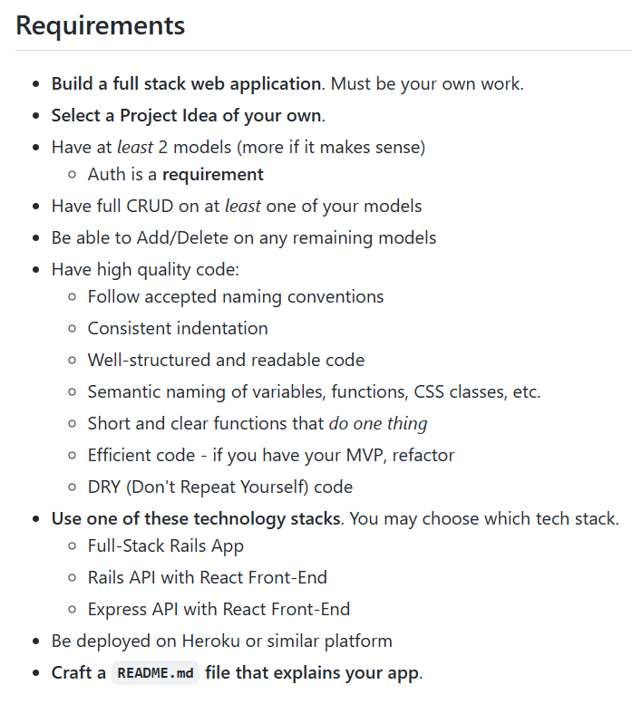
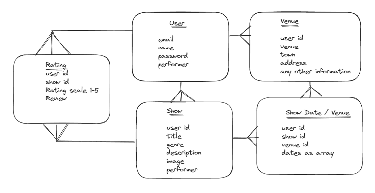
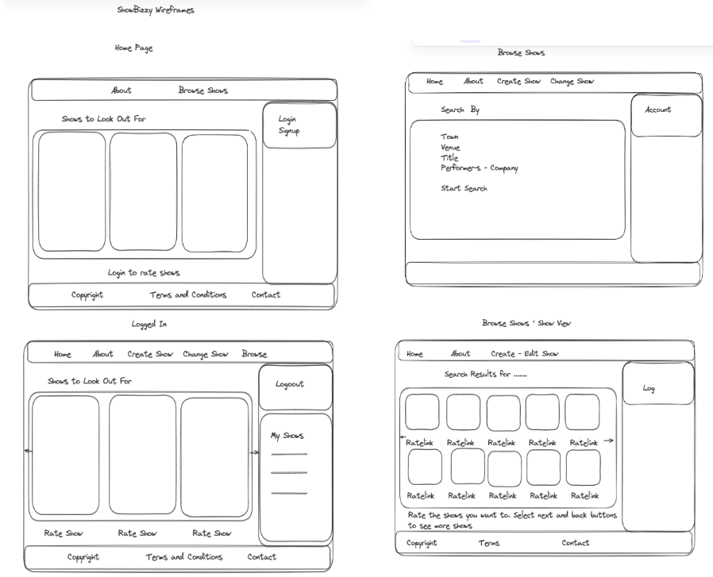
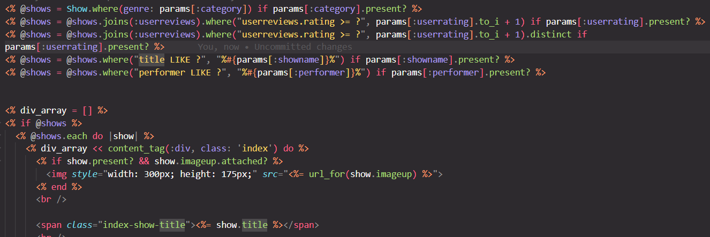

# ShowBizzy

##About

ShowBizzy was created as a final individual General Assembly Project. The timeframe was just under two weeks. 
Here's a link to the deployed project: [ShowBizzy](https://fast-cove-85480.herokuapp.com/). At the time of writing there isn't a solution to display images in a live environment which makes it harder to gauge the look and feel of the app. This will be looked into. 

##Technologies Used

Framework: 
-Ruby on Rails 7

Languages: 
-Ruby(3.0.4), JavaScript, CSS, ERB, Postgres Database, SQL

Gems (Ruby): 
-Devise, Active Storage

Version Control: 
-GIT

Operating System: 
-Windows with Ubunti

Code Editor: 
-Visual Studio

Deployment: 
-Heroku

#Background

I chose ShowBizzy as I have personally put on a number of shows and I understand the need for performers to get audience members' thoughts in order to continue to improve. It was an idea I had a few years ago but at the time lacked the technical knowledge to implement this. 

##Brief

The instructions were to create a full stack model with three options: 

-A Full-Stack Rails App
-Rails API with React Front-End
-Express API with React Front-End
For this project it was decided to go with the Full-Stack Rails App as this waasn't something I had done before. 
The full project requirements are captured below. 

##Planning
Initially some user stories were written to serve as a basis for the scope. The project ended up addressing most of these with some likely to be implemented at a later point. 

This was followed by an ERD using Excalidraw. Again here the ERD was changed once by the tutors, another time by me to follow the path I had envisioned. 
Halfway through the project two of the models(places and timings) were descoped to ensure it could be achieved to a standard I was aiming for. 

The next steps was creating wireframes, also utilising Excalidraw.

It was helpful for me to engage in the planning to get a good feeling of what I was going to implement. As it was felt that good planning would save time in the long run over half a day was spent on the planning process. Although the scope ended up changing a bit, the core purpose of the site as maintained. 

##Setup

To start with, a Rails App with Javascript and Postgres was created on Ubuntu and linked to my GA Github Repository. 

As a next step, the Devise User Authentication Tool was installed. It ws felt that user authentication could be one of the more complicated pieces of functionality so the aim was to get this working early. 
Thankfully the user authentication was set up relatively quickly without any noticeable issues. 

The routes were then defined using the "resources" method. 

Initial models and their controller files were then created and migrated. The models were then set up as per their relationships with each other(here: multiple one to many relationships).

##Code Structure

Three models were utilised for the app: a User model, a Show model and a Review model. The User model has a one to many reationship with the Show model and the Review model. The Show model has a one to many relationship with the Review model. 

A root page was set up as a home page which linked to the different sections. 

##Coding Logic

An interesting problem presented itself with impementing a search functionality for different criteria. 
I had the idea that since the user needs to loop through the shows in order for their individual elements to be displayed - The shows parameter could be defined according to the search criteria. Below is an example of the code utilised to carry this out: 

Things you may want to cover:

* Ruby version

* System dependencies

* Configuration

* Database creation

* Database initialization

* How to run the test suite

* Services (job queues, cache servers, search engines, etc.)

* Deployment instructions

* ...
