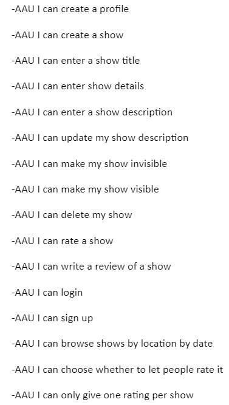

# ShowBizzy

##About
ShowBizzy was created as a final individual General Assembly Project. The timeframe was just under two weeks. 
Here's a link to the deployed project: [ShowBizzy](https://fast-cove-85480.herokuapp.com/). At the time of writing there isn't a solution to display images in a live environment which makes it harder to gauge the look and feel of the app. This will be looked into. 

#Background
I chose ShowBizzy as I have personally put on a number of shows and I understand the need for performers to get audience members' thoughts in order to continue to improve. It was an idea I had a few years ago but at the time lacked the technical knowledge to implement this. 

##Brief
The instructions were to create a full stack model with three options: 
-A Full-Stack Rails App
-Rails API with React Front-End
-Express API with React Front-End
For this project it was decided to go with the Full-Stack Rails App as this waasn't something I had done before. 
The full project requirements are captured below. 

##Planning
Initially some user stories were written to serve as a basis for the scope. The project ended up addressing most of these with some likely to be implemented at a later point. 

This was followed by an ERD using Excalidraw. Again here the ERD was changed once by the tutors, another time by me to follow the path I had envisioned. 
Halfway through the project two of the models(places and timings) were descoped to ensure it could be achieved to a standard I was aiming for. 

The next steps was creating wireframes, also utilising Excalidraw.

##Setup
To start with, a Rails App was created on Ubuntu and linked to my GA Github Repository. 

Things you may want to cover:

* Ruby version

* System dependencies

* Configuration

* Database creation

* Database initialization

* How to run the test suite

* Services (job queues, cache servers, search engines, etc.)

* Deployment instructions

* ...
